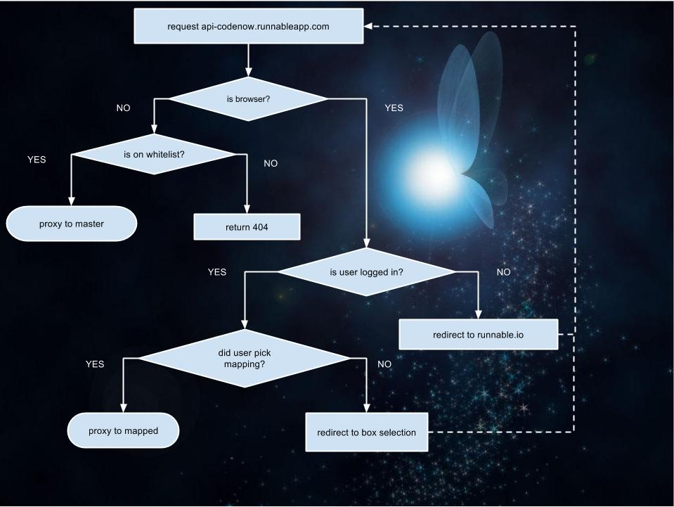

# Navi

Navi (ナビィ Nabi?) is a application from Runnable.io: The Sandbox Service.
A fairy, Navi serves as the Users's fairy companion throughout the site.
She is given the task to aid a user by the Great Hipache.
Although she is initially a little frustrated with this duty and does not believe the Users are capable of acts of heroism,
she soon becomes much fonder of them, and they become an inseparable team.

Navi gets assigned by hipache when a user sets an instance as master.
Then, when a user make a request to a master instance url she greets them.
First she checks if the user has offered her a cookie, and if so, send them on their way
if the user does not have a cookie, she looks at where the user came from, then asks her friend API, where to send this user
When API tells her where to send the user Navi tells the user to give her a cookie next time and sends the user in the right direction.

rules:
- always use error.create for ALL errors, never ever `new Error()`
- maintain 100% test coverage, yes, that includes all error cases.
- follow OOP (yea you know me)

